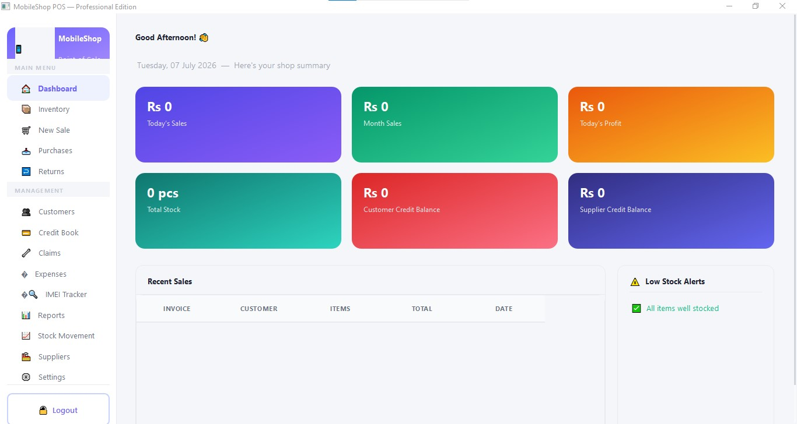
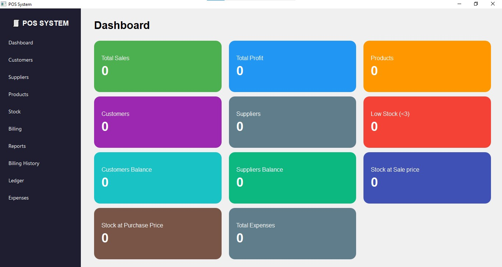

# Hi 👋, I'm Talha Farooq

### Full Stack Web Developer | Python & Desktop App Developer | C# / .NET Developer | Graphic Designer

  
  
  

---

## 💫 About Me

I’m **Talha Farooq**, a developer focused on building **modern, practical, and user-centered software solutions** across both **web** and **desktop platforms**. My work combines **full stack web development**, **desktop application development**, and **business-focused software systems** with an emphasis on clean interfaces, structured backend logic, and real-world usability.

I enjoy turning ideas into functional products — whether it’s a **desktop POS system**, a **business management solution**, or a **web application**. My development approach is centered around **problem solving**, **practical implementation**, and continuously improving through project-based learning.

- 🌐 Full Stack Web Development  
- 🐍 Python & PyQt6 Desktop Applications  
- ⚙️ C# / .NET Development  
- 🎨 Graphic Design & UI-focused Interfaces  
- 🗄️ Database-driven Software Solutions  
- 🚀 Building practical applications for real-world workflows  

---

## 🌐 Connect With Me

  
  
  

---

## 💻 Tech Stack

### Languages

  

### Frontend & Web Development

  

### Backend & Databases

  

### Desktop & Software Development

  

### Tools & Platforms

  

---

# 🚀 Featured Projects

## 1) Mobile Shop POS System

  

Built a desktop-based **Mobile Shop POS System** using **Python and PyQt6** to digitize and optimize retail operations for a mobile phone shop. The application was designed as a complete business management solution covering inventory control, sales, purchases, customer and supplier records, billing workflows, credit management, and IMEI-based mobile tracking.

The system was developed with a strong focus on practical business use cases, enabling efficient handling of stock records, customer balances, supplier payments, expense tracking, product returns, claims, and movement of IMEI-based devices. It also provides a dashboard-driven overview of key business metrics such as sales, profit, stock levels, and outstanding balances, helping improve operational visibility and workflow management.

### Core Modules & Capabilities
- Inventory, sales, and purchase management  
- Customer and supplier account handling  
- Credit book and separate ledger tracking  
- IMEI-based device tracking and stock movement  
- Returns, claims, and expense recording  
- Reporting, low-stock alerts, and dashboard insights  
- User-friendly desktop interface for day-to-day retail management  

**Technologies:** `Python` `PyQt6` `SQLite`

---

## 2) Electronics POS System

  

Built an **Electronics POS System** as a desktop-based retail management application using **Python and PyQt6**. The software was designed to support day-to-day electronics store operations by managing sales, products, inventory, customer and supplier records, billing history, ledger balances, and expense tracking within a unified desktop environment.

The project emphasizes practical retail workflow automation by providing modules for stock monitoring, billing, product handling, balance management, and reporting. A dashboard interface was implemented to give a quick overview of sales performance, total profit, product count, stock value, low-stock items, and financial balances, enabling more efficient business monitoring and management.

### Core Features
- Product, stock, and inventory management  
- Sales and billing workflow management  
- Customer and supplier record handling  
- Ledger and balance tracking  
- Expense recording and financial overview  
- Low-stock monitoring and stock valuation  
- Dashboard-based retail insights and reporting  

**Technologies:** `Python` `PyQt6` `SQLite`

---

## 📈 GitHub Stats

  

---

## 🧠 Current Focus

- Building **web applications** with **Next.js** and **Node.js**
- Developing **desktop business applications** with **Python + PyQt6**
- Improving expertise in **C# / .NET**
- Working on **retail management and POS software solutions**
- Strengthening **database design and backend problem solving**

---

## 🏆 Goals

- Build impactful **full stack web applications**
- Develop professional **desktop software products**
- Create more **real-world business management systems**
- Improve software architecture, clean code, and product thinking
- Continue growing as a **software developer and problem solver**

---

## 💡 Developer Philosophy

> I enjoy building software that solves real-world problems through practical development, clean interfaces, structured logic, and continuous learning.

---

### Thanks for visiting my profile 🚀

